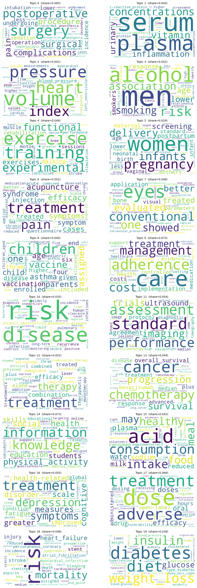

# PubMed TopicModeling 

Latent Dirichlet Allocation (LDA) applied to 2,000 PubMed abstracts using collapsed Gibbs sampling to discover 20 latent biomedical topics.

output quality is evaluated using topic coherence metrics (c_v & c_npmi), indicating interpretable biomedical topics.

## Learned Topics

